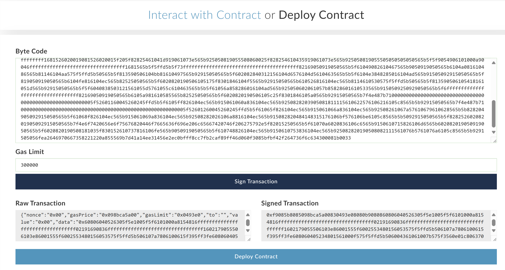

# Smart Contracts

## Ganache Truffle Site
Framework para interactuar con Smart Contracts, nos lo descargaremos (https://archive.trufflesuite.com/ganache/)

## MyEtherWallet
MyEtherWallet es una puerta de entrada a la blockchain de Ethereum, permitiendo a los usuarios gestionar sus propios fondos sin una plataforma centralizada. (https://github.com/MyEtherWallet/MyEtherWallet.git)
- "index.html" --> 
- Importante no perder la clave privada

## Remix Solidity IDE
IDE para poder crear un Smart Contract
- dovecoin.sol ha sido creado con este IDE

## Demo

1. Entramos en Ganache, primer paso es decidir cuál va a ser la dirección de nuestra cuenta
   - Podemos elegir la primera misma, usaremos su clave privada en la wallet

2. Entramos MyEtherWallet y configuramos la wallet
   - Añadir red o nodo personalizado >> configuramos uno (nombre: `dovecoin_test`, url: `ganache`, puerto: `ganache`, protocolo: `ETH`)
   - Pestaña **Contracts** >> **Deploy Contract**
     - **ByteCode**: remix IDE >> buscamos `Compilation details` de `dovecoin_ico.sol` y copiamos lo que aparece en "object".
     - Seleccionamos la clave privada de la dirección (de Ganache, "Show Keys"):  
       Dirección: `0xcB646CE3B7c9b7a4F806069DDd8fd27e51775052`  
       Clave privada: `0xcb3459ffbe0d55967628a8a1bdcdb184c2e2027d6c990903e823d2ec4a5a7c37`
     - Ya podemos firmar una transacción  
     
       
     - Veremos en ganache que se ha añadido un bloque y tenemos menos ETH. 

3º Una vez tenemos el Smart Contract desplegado puedo interactuar con un contrato:
- Contract Address: en el bloque "created contract address"
- ABI / JSON Interface: lo sacamos de remix IDE, compilation IDE >> ABI. Puntos de acceso públicos al código de solidity (variables y métodos públicos)
- Una vez tenemos eso podemos seleccionar una función o una variable de nuestro smart contract 

